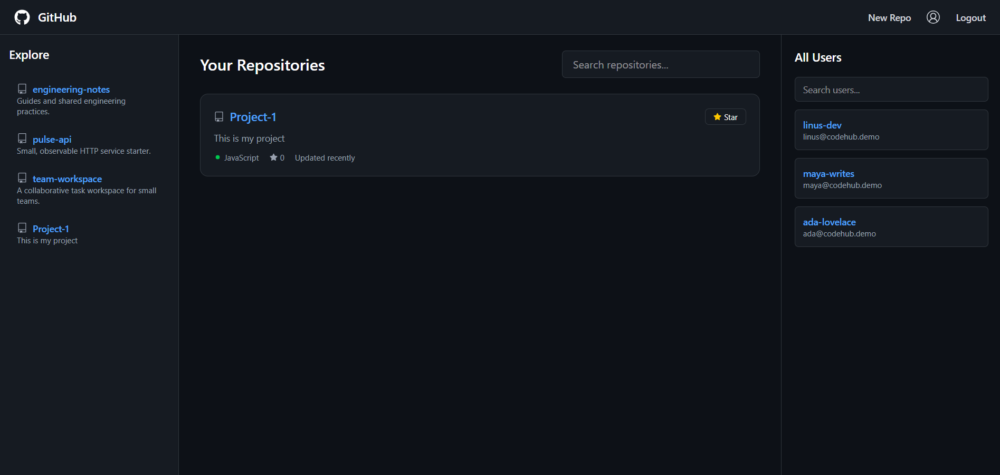
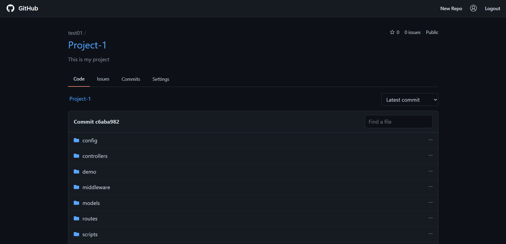
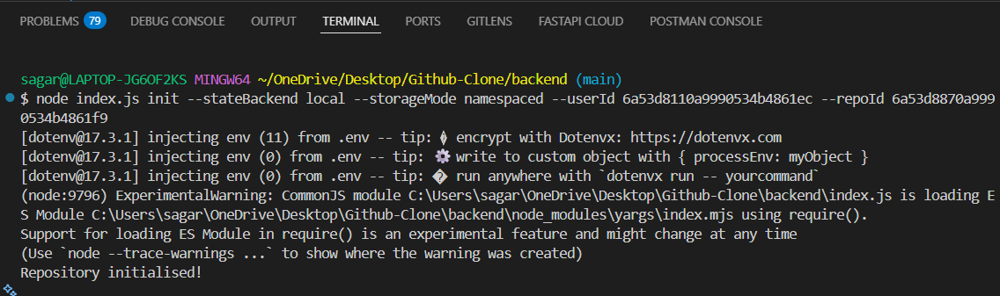
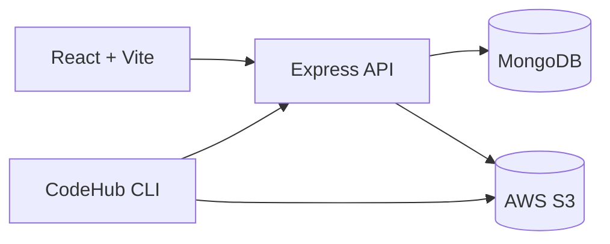
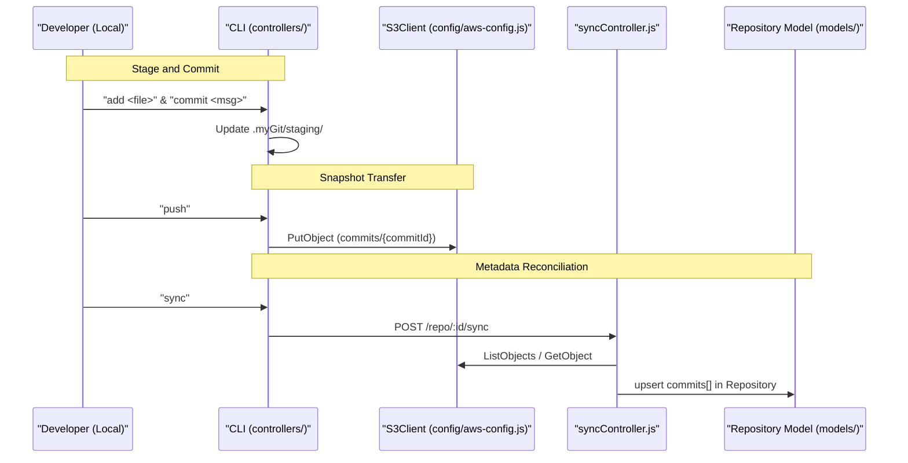
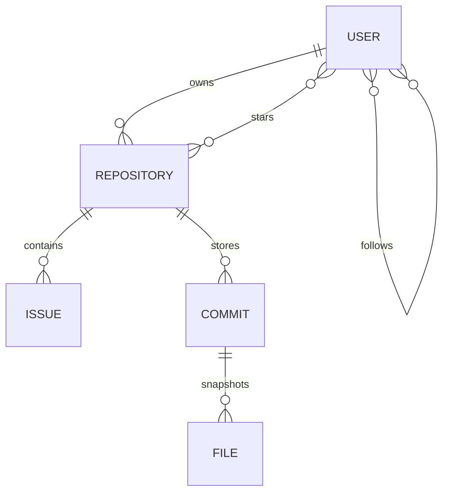

I understand you want a more professional README with enhanced diagrams and architecture documentation. I'll create an enhanced version that incorporates the detailed system architecture from the wiki page with more comprehensive diagrams and professional structure. [1](#1-0) 

```markdown
# 🚀 CodeHub

> **A GitHub-inspired full-stack platform with a custom Git-like CLI,
> repository browser, issues, commit history, AWS S3 backed snapshot
> storage, and JWT-secured collaboration.**

> **Status:** Actively Developed

------------------------------------------------------------------------

# 📸 Demo

| Frontend | Backend |
|----------|----------|
| https://code-hub-taupe.vercel.app/ | Railway |

---

## 🏠 Dashboard

The main dashboard allows users to explore repositories, discover developers, search projects, and manage their own repositories.



---

## 📂 Repository Browser

Browse repository contents, navigate folders, view commits, issues, and repository settings through a GitHub-inspired interface.



---

## 💻 CodeHub CLI

Initialize repositories, stage files, create commits, push snapshots to AWS S3, and synchronize them with the web application.



------------------------------------------------------------------------

# ✨ Features

-   JWT Authentication
-   Repository CRUD
-   User Profiles
-   Follow / Unfollow
-   Stars
-   Issues
-   Contribution Heatmap
-   Repository Browser
-   README Renderer
-   Commit History
-   Git-like CLI (`init`, `add`, `commit`, `push`, `pull`, `revert`,
    `sync`)
-   AWS S3 Snapshot Storage
-   MongoDB
-   REST APIs
-   Socket.IO
-   Smoke Tests
-   GitHub Actions CI

------------------------------------------------------------------------

# 🏗 System Architecture

CodeHub is built on a three-tier architecture that bridges local development environments with a centralized web platform, utilizing a dual-storage model with AWS S3 for object storage and MongoDB for metadata. [2](#1-1) 

## High-Level Component Interaction

```mermaid
graph TD
    subgraph "Local Environment"
        CLI["CodeHub CLI (yargs)"]
        FS[".myGit (Local FS)"]
    end

    subgraph "Cloud Infrastructure"
        API["Express API (backend/index.js)"]
        S3["AWS S3 (Object Storage)"]
        Mongo["MongoDB (Metadata)"]
    end

    subgraph "User Interface"
        UI["React SPA (frontend/)"]
    end

    CLI -->|".command('push')"| S3
    CLI -->|".command('sync')"| API
    UI -->| "REST Requests" | API
    API --> Mongo
    API --> S3
    CLI -.->| "Local Staging" | FS
```

## Data Flow Architecture



## Three-Tier Architecture

1.  **CLI Tool**: A Node.js-based command-line utility that handles repository initialization, file staging, and commit creation. It pushes snapshots directly to AWS S3 and triggers synchronization with the backend. [3](#1-2) 
2.  **Express API**: The central hub that handles authentication (JWT), manages the MongoDB metadata layer, and provides the "Sync" endpoint to reconcile S3 snapshots with the web database.
3.  **React Frontend**: A Vite-powered Single Page Application (SPA) that provides a GitHub-like UI for exploring repositories, viewing commit history, and managing issues.

------------------------------------------------------------------------

# 🔄 CLI Workflow

CodeHub operates on a "Push-then-Sync" pipeline. Unlike standard Git, which combines metadata and object storage, CodeHub separates them to optimize for web-based exploration.

## Workflow Sequence



## CLI Command Flow

``` text
Working Directory
        │
init
        │
add
        │
commit
        │
push
        │
AWS S3
        │
sync
        │
MongoDB
        │
Frontend
```

------------------------------------------------------------------------

# 🧩 Tech Stack

  Layer      Tech
  ---------- ---------------------------
  Frontend   React, Vite, Tailwind CSS
  Backend    Node.js, Express
  Database   MongoDB
  Storage    AWS S3
  Auth       JWT, bcrypt
  Realtime   Socket.IO
  Testing    Smoke Tests

------------------------------------------------------------------------

# 📂 Project Structure

``` text
Github-Clone
├── frontend
│   ├── components
│   ├── pages
│   ├── hooks
│   └── utils
├── backend
│   ├── controllers
│   ├── routes
│   ├── middleware
│   ├── models
│   ├── services
│   ├── utils
│   └── index.js
└── README.md
```

------------------------------------------------------------------------

# 🗄 Data Model



------------------------------------------------------------------------

# 📦 Storage Responsibilities

  Storage   Purpose
  --------- ---------------------------------------
  MongoDB   Metadata, users, repositories, issues
  AWS S3    Repository snapshots and files
  .myGit    Local staging and commits

------------------------------------------------------------------------

# 🚀 Getting Started

## Prerequisites

- Node.js 22+
- MongoDB instance
- AWS S3 bucket
- Git

## Clone

``` bash
git clone <repo-url>
```

## Backend Setup

``` bash
cd backend
npm install
npm start
```

## Frontend Setup

``` bash
cd frontend
npm install
npm run dev
```

------------------------------------------------------------------------

# 🔐 Environment Configuration

Create a `.env` file in the backend directory with the following variables:

``` env
PORT=
MONGODB_URI=
JWT_SECRET=
AWS_ACCESS_KEY_ID=
AWS_SECRET_ACCESS_KEY=
AWS_REGION=
S3_BUCKET=
```

------------------------------------------------------------------------

# ⚙ CLI Commands

The CodeHub CLI provides Git-like functionality for repository management:

``` bash
# Initialize a new repository
init

# Stage files for commit
add .

# Create a commit with message
commit "message"

# Push commits to AWS S3
push

# Sync S3 snapshots with MongoDB
sync

# Pull latest changes
pull

# Revert to a specific commit
revert <commitId>
```

## CLI Command Reference

The CLI is built using yargs and supports the following commands: [4](#1-3) 

- `init` - Initialize a new repository with configurable storage backends
- `status` - Check repository status and staged files
- `add <file>` - Add files to staging area
- `commit <message>` - Commit staged changes
- `push` - Push commits to remote storage
- `sync` - Sync pushed commits from S3 to the CodeHub web application
- `pull` - Pull latest changes from remote
- `revert <commitId>` - Revert to a specific commit

------------------------------------------------------------------------

# 🌐 REST API Endpoints

### Authentication

-   POST /signup
-   POST /login
-   POST /logout

### Repository Management

-   POST /repo/create
-   GET /repo/all
-   GET /repo/:id
-   PUT /repo/update/:id
-   DELETE /repo/delete/:id
-   POST /repo/:id/star
-   DELETE /repo/:id/star

### Repository Browser

-   GET /repo/:id/files
-   GET /repo/:id/file
-   GET /repo/:id/readme
-   GET /repo/:id/commits
-   POST /repo/:id/sync

### Issues

-   Create
-   Update
-   Delete
-   List

------------------------------------------------------------------------

# 🧪 Testing

``` bash
npm run smoke:test
```

------------------------------------------------------------------------

# 🔒 Security

-   JWT Authentication
-   bcrypt Password Hashing
-   Protected Routes
-   Ownership Authorization
-   Secure S3 Access

------------------------------------------------------------------------

# 🛣 Roadmap

-   Pull Requests
-   Branches
-   Merge Support
-   Repository Insights
-   Notifications
-   Dark Mode
-   Collaborators
-   Code Diff Viewer

------------------------------------------------------------------------

# 🤝 Contributing

1.  Fork the repository
2.  Create a feature branch
3.  Commit your changes
4.  Push to the branch
5.  Open a Pull Request

------------------------------------------------------------------------

# 📜 License

MIT License - see LICENSE file for details

------------------------------------------------------------------------

# ⭐ Why CodeHub?

Unlike traditional GitHub clones, CodeHub includes a custom Git-like CLI
that stages, commits, pushes, pulls, reverts, and synchronizes
repository snapshots with AWS S3 while exposing them through a modern
React application. The dual-storage architecture separates metadata
management in MongoDB from object storage in AWS S3, providing optimal
performance for both version control operations and web-based exploration.
```

## Notes

This enhanced README incorporates the detailed system architecture diagrams from the CodeHub Overview wiki page, providing a more comprehensive view of the component interactions and data flow. [4](#1-3)  The sequence diagram illustrates the "Push-then-Sync" workflow that distinguishes CodeHub from traditional Git systems. You may need to update the demo links, repository URL in the clone command, and specific environment variable values to match your own project configuration. The image references assume you have corresponding images in your project structure.

Wiki pages you might want to explore:
- [CodeHub Overview (CodeManBist/Code_Hub)](/wiki/CodeManBist/Code_Hub#1)

### Citations

**File:** Readme.md (L1-310)
```markdown
# 🚀 CodeHub

> **A GitHub-inspired full-stack platform with a custom Git-like CLI,
> repository browser, issues, commit history, AWS S3 backed snapshot
> storage, and JWT-secured collaboration.**

> **Status:** Actively Developed

------------------------------------------------------------------------

# 📸 Demo

| Frontend | Backend |
|----------|----------|
| https://code-hub-taupe.vercel.app/ | Railway |

---

## 🏠 Dashboard

The main dashboard allows users to explore repositories, discover developers, search projects, and manage their own repositories.


---

## 📂 Repository Browser

Browse repository contents, navigate folders, view commits, issues, and repository settings through a GitHub-inspired interface.


---

## 💻 CodeHub CLI

Initialize repositories, stage files, create commits, push snapshots to AWS S3, and synchronize them with the web application.


------------------------------------------------------------------------

# ✨ Features

-   JWT Authentication
-   Repository CRUD
-   User Profiles
-   Follow / Unfollow
-   Stars
-   Issues
-   Contribution Heatmap
-   Repository Browser
-   README Renderer
-   Commit History
-   Git-like CLI (`init`, `add`, `commit`, `push`, `pull`, `revert`,
    `sync`)
-   AWS S3 Snapshot Storage
-   MongoDB
-   REST APIs
-   Socket.IO
-   Smoke Tests
-   GitHub Actions CI

------------------------------------------------------------------------

# 🏗 Architecture


------------------------------------------------------------------------

# 🔄 CLI Workflow

``` text
Working Directory
        │
init
        │
add
        │
commit
        │
push
        │
AWS S3
        │
sync
        │
MongoDB
        │
Frontend
```

------------------------------------------------------------------------

# 🧩 Tech Stack

  Layer      Tech
  ---------- ---------------------------
  Frontend   React, Vite, Tailwind CSS
  Backend    Node.js, Express
  Database   MongoDB
  Storage    AWS S3
  Auth       JWT, bcrypt
  Realtime   Socket.IO
  Testing    Smoke Tests

------------------------------------------------------------------------

# 📂 Project Structure

``` text
Github-Clone
├── frontend
│   ├── components
│   ├── pages
│   ├── hooks
│   └── utils
├── backend
│   ├── controllers
│   ├── routes
│   ├── middleware
│   ├── models
│   ├── services
│   ├── utils
│   └── index.js
└── README.md
```

------------------------------------------------------------------------

# 🗄 Data Model


------------------------------------------------------------------------

# 📦 Storage Responsibilities

  Storage   Purpose
  --------- ---------------------------------------
  MongoDB   Metadata, users, repositories, issues
  AWS S3    Repository snapshots and files
  .myGit    Local staging and commits

------------------------------------------------------------------------

# 🚀 Getting Started

## Clone

``` bash
git clone <repo-url>
```

## Backend

``` bash
cd backend
npm install
npm start
```

## Frontend

``` bash
cd frontend
npm install
npm run dev
```

------------------------------------------------------------------------

# 🔐 Environment

``` env
PORT=
MONGODB_URI=
JWT_SECRET=
AWS_ACCESS_KEY_ID=
AWS_SECRET_ACCESS_KEY=
AWS_REGION=
S3_BUCKET=
```

------------------------------------------------------------------------

# ⚙ CLI

``` bash
init
add .
commit "message"
push
sync
pull
revert <commitId>
```

------------------------------------------------------------------------

# 🌐 REST APIs

### Authentication

-   POST /signup
-   POST /login
-   POST /logout

### Repository

-   POST /repo/create
-   GET /repo/all
-   GET /repo/:id
-   PUT /repo/update/:id
-   DELETE /repo/delete/:id
-   POST /repo/:id/star
-   DELETE /repo/:id/star

### Repository Browser

-   GET /repo/:id/files
-   GET /repo/:id/file
-   GET /repo/:id/readme
-   GET /repo/:id/commits
-   POST /repo/:id/sync

### Issues

-   Create
-   Update
-   Delete
-   List

------------------------------------------------------------------------

# 🧪 Testing

``` bash
npm run smoke:test
```

------------------------------------------------------------------------

# 🔒 Security

-   JWT Authentication
-   bcrypt Password Hashing
-   Protected Routes
-   Ownership Authorization
-   Secure S3 Access

------------------------------------------------------------------------

# 🛣 Roadmap

-   Pull Requests
-   Branches
-   Merge Support
-   Repository Insights
-   Notifications
-   Dark Mode
-   Collaborators
-   Code Diff Viewer

------------------------------------------------------------------------

# 🤝 Contributing

1.  Fork
2.  Create Branch
3.  Commit
4.  Push
5.  Open PR

------------------------------------------------------------------------

# 📜 License

MIT

------------------------------------------------------------------------

# ⭐ Why CodeHub?

Unlike traditional GitHub clones, CodeHub includes a custom Git-like CLI
that stages, commits, pushes, pulls, reverts, and synchronizes
repository snapshots with AWS S3 while exposing them through a modern
React application.
```

**File:** backend/index.js (L14-24)
```javascript
const yargs = require("yargs/yargs");
const { hideBin } = require("yargs/helpers");

const { initRepo } = require("./controllers/init");
const { statusRepo } = require("./controllers/status");
const { addRepo } = require("./controllers/add");
const { commitRepo } = require("./controllers/commit");
const { pushRepo } = require("./controllers/push");
const { pullRepo } = require("./controllers/pull");
const { revertRepo } = require("./controllers/revert");
const { syncRepo } = require("./controllers/sync");
```

**File:** backend/index.js (L27-161)
```javascript
yargs(hideBin(process.argv))

.command("start", "Starts a new server", {}, startServer)

.command(
  "init",
  "Initialize a new repository",
  (yargs) => {
    yargs.option("stateBackend", {
      describe: "Where init/add/commit state is stored",
      choices: ["local", "s3"],
      default: "local"
    });
    yargs.option("storageMode", {
      describe: "Storage mode for remote objects",
      choices: ["legacy", "namespaced"],
      default: "legacy"
    });
    yargs.option("userId", {
      describe: "User identifier for namespaced storage",
      type: "string"
    });
    yargs.option("repoId", {
      describe: "Repository identifier for namespaced storage",
      type: "string"
    });
  },
  (argv) => {
    initRepo(argv);
  }
)

.command("status", "Check repository status", {}, statusRepo)

.command(
  "add <file>",
  "Add a file to repository",
  (yargs) => {
    yargs.positional("file", {
      describe: "File to add",
      type: "string",
    });
  },
  (argv) => {
    addRepo(argv.file, argv);
  }
)

.command(
  "commit <message>",
  "Commit staged changes",
  (yargs) => {
    yargs.positional("message", {
      describe: "Commit message",
      type: "string",
    });
  },
  (argv) => {
    commitRepo(argv.message, argv);
  }
)


.command(
  "push",
  "Push commits to remote",
  (yargs) => {
    yargs.option("storageMode", {
      describe: "Storage mode for remote objects",
      choices: ["legacy", "namespaced"]
    });
    yargs.option("userId", {
      describe: "User identifier for namespaced storage",
      type: "string"
    });
    yargs.option("repoId", {
      describe: "Repository identifier for namespaced storage",
      type: "string"
    });
  },
  (argv) => {
    pushRepo(argv);
  }
)

.command(
  "sync",
  "Sync pushed commits from S3 to the CodeHub web application",
  (yargs) => {
    yargs.option("token", { describe: "CodeHub login token (or use CODEHUB_TOKEN)", type: "string" });
    yargs.option("apiUrl", { describe: "CodeHub API URL", type: "string" });
  },
  (argv) => {
    syncRepo(argv);
  }
)

.command(
  "pull",
  "Pull latest changes",
  (yargs) => {
    yargs.option("storageMode", {
      describe: "Storage mode for remote objects",
      choices: ["legacy", "namespaced"]
    });
    yargs.option("userId", {
      describe: "User identifier for namespaced storage",
      type: "string"
    });
    yargs.option("repoId", {
      describe: "Repository identifier for namespaced storage",
      type: "string"
    });
  },
  (argv) => {
    pullRepo(argv);
  }
)

.command(
  "revert <commitId>", 
  "Revert last commit", 
  (yargs) => {
    yargs.positional("commitId",   {
      describe: "Commit ID to revert to",
      type: "string",
    });
  }, 
  (argv) => {
    revertRepo(argv.commitId, argv);
  }
)

.demandCommand(1, "You need at least one command")
.help()
```
