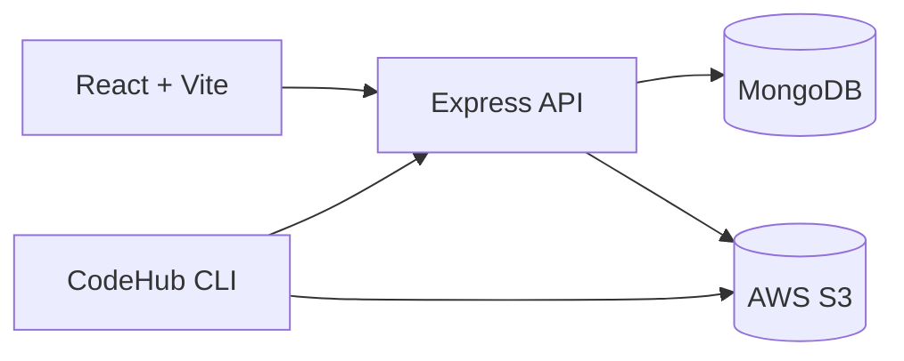
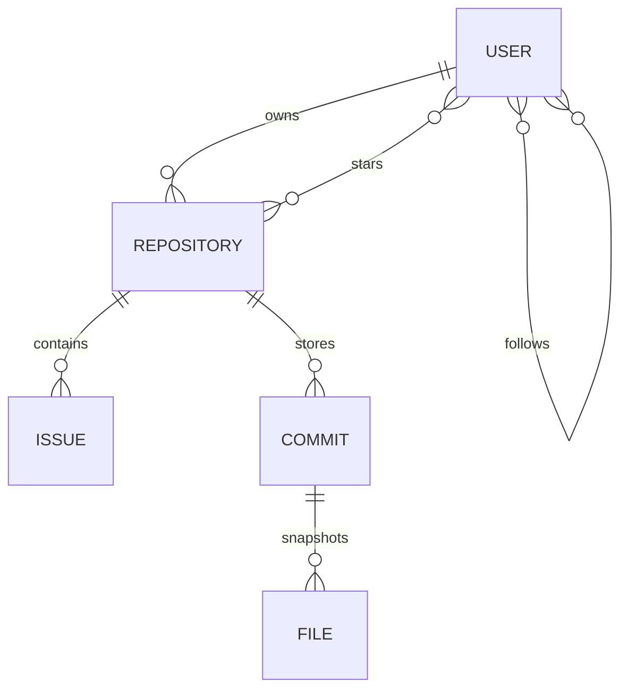
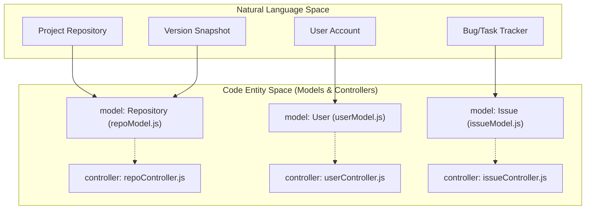
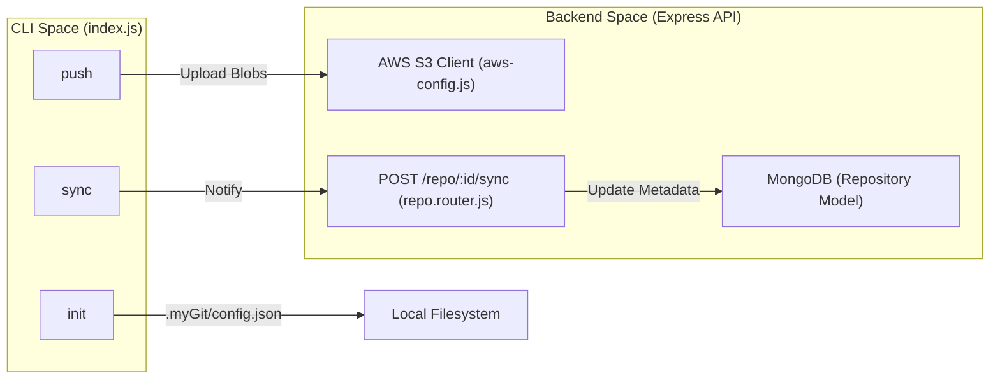

# 🚀 CodeHub

> **A GitHub-inspired full-stack platform with a custom Git-like CLI,
> repository browser, issues, commit history, AWS S3 backed snapshot
> storage, and JWT-secured collaboration.**

> **Status:** Actively Developed

------------------------------------------------------------------------

# 📸 Demo

| Frontend | Backend |
|----------|----------|
| https://code-hub-taupe.vercel.app/ | Railway |

---

## 🏠 Dashboard

The main dashboard allows users to explore repositories, discover developers, search projects, and manage their own repositories.


---

## 📂 Repository Browser

Browse repository contents, navigate folders, view commits, issues, and repository settings through a GitHub-inspired interface.


---

## 💻 CodeHub CLI

Initialize repositories, stage files, create commits, push snapshots to AWS S3, and synchronize them with the web application.


------------------------------------------------------------------------

# ✨ Features

-   JWT Authentication
-   Repository CRUD
-   User Profiles
-   Follow / Unfollow
-   Stars
-   Issues
-   Contribution Heatmap
-   Repository Browser
-   README Renderer
-   Commit History
-   Git-like CLI (`init`, `add`, `commit`, `push`, `pull`, `revert`,
    `sync`)
-   AWS S3 Snapshot Storage
-   MongoDB
-   REST APIs
-   Socket.IO
-   Smoke Tests
-   GitHub Actions CI

------------------------------------------------------------------------

# 🏗 Architecture



------------------------------------------------------------------------

# 🔄 CLI Workflow

```text
Working Directory
        │
init
        │
add
        │
commit
        │
push
        │
AWS S3
        │
sync
        │
MongoDB
        │
Frontend
```

------------------------------------------------------------------------

# 🧩 Tech Stack

| Layer      | Tech                           |
| ---------- | ------------------------------ |
| Frontend   | React, Vite, Tailwind CSS      |
| Backend    | Node.js, Express               |
| Database   | MongoDB                        |
| Storage    | AWS S3                         |
| Auth       | JWT, bcrypt                    |
| Realtime   | Socket.IO                      |
| Testing    | Smoke Tests                    |

------------------------------------------------------------------------

# 📂 Project Structure

```text
Github-Clone
├── frontend
│   ├── components
│   ├── pages
│   ├── hooks
│   └── utils
├── backend
│   ├── controllers
│   ├── routes
│   ├── middleware
│   ├── models
│   ├── services
│   ├── utils
│   └── index.js
└── README.md
```

------------------------------------------------------------------------

# 🗄 Data Model



------------------------------------------------------------------------

# 📦 Storage Responsibilities

| Storage   | Purpose                                      |
| --------- | -------------------------------------------- |
| MongoDB   | Metadata, users, repositories, issues        |
| AWS S3    | Repository snapshots and files               |
| .myGit    | Local staging and commits                    |

------------------------------------------------------------------------

# 🔧 System Architecture Diagrams

## Code Entity Relationship

This diagram maps natural language concepts to the specific Mongoose models and controller logic that manage them.



## CLI Workflow to API Integration

This diagram shows how CLI commands map to backend routes and storage systems.



## CLI Configuration Resolution Flow

This diagram shows how `resolveGitOptions` merges different configuration sources.

```mermaid
graph TD
    "Start" --> "readRepoConfig"["readRepoConfig('.myGit/config.json')"]
    "readRepoConfig" --> "resolveGitOptions"["resolveGitOptions(config, argv)"]
    
    subgraph "gitConfig.js"
        "resolveGitOptions" --> "Check_Argv"{"Flag in argv?"}
        "Check_Argv" -- "Yes" --> "Use_Argv"["Use CLI Flag"]
        "Check_Argv" -- "No" --> "Check_Config"{"Key in config.json?"}
        "Check_Config" -- "Yes" --> "Use_Config"["Use Config File"]
        "Check_Config" -- "No" --> "Check_Env"{"Env Var set?"}
        "Check_Env" -- "Yes" --> "Use_Env"["Use process.env"]
        "Check_Env" -- "No" --> "Use_Default"["Use Hardcoded Default"]
    end
    
    "Use_Argv" --> "Result"
    "Use_Config" --> "Result"
    "Use_Env" --> "Result"
    "Use_Default" --> "Result"
    "Result" --> "resolvePrefixes"["resolvePrefixes(options)"]
```

## Commit Process: Local vs S3 Backend

This diagram maps the `commitRepo` function logic to the physical storage entities.

```mermaid
graph LR
    subgraph "CLI Entity Space"
        "commitRepo"["commitRepo(message, argv)"]
        "uuid"["uuidv4()"]
    end

    subgraph "Local Backend (.myGit)"
        "StagingDir"["staging/"]
        "CommitsDir"["commits/{commitId}/"]
        "CommitJSON_L"["commit.json"]
    end

    subgraph "S3 Backend (AWS)"
        "S3_Staging"["Prefix: staging/"]
        "S3_Commits"["Prefix: commits/{commitId}/"]
        "CommitJSON_S"["Object: commit.json"]
    end

    "commitRepo" --> "uuid"
    "commitRepo" -- "stateBackend=local" --> "StagingDir"
    "StagingDir" -- "fs.copyFile" --> "CommitsDir"
    "commitRepo" -- "fs.writeFile" --> "CommitJSON_L"

    "commitRepo" -- "stateBackend=s3" --> "S3_Staging"
    "S3_Staging" -- "CopyObjectCommand" --> "S3_Commits"
    "commitRepo" -- "PutObjectCommand" --> "CommitJSON_S"
```

------------------------------------------------------------------------

# 🚀 Getting Started

## Clone

```bash
git clone <repo-url>
```

## Backend

```bash
cd backend
npm install
npm start
```

## Frontend

```bash
cd frontend
npm install
npm run dev
```

------------------------------------------------------------------------

# 🔐 Environment

```env
PORT=
MONGODB_URI=
JWT_SECRET=
AWS_ACCESS_KEY_ID=
AWS_SECRET_ACCESS_KEY=
AWS_REGION=
S3_BUCKET=
```

------------------------------------------------------------------------

# ⚙ CLI Commands Reference

## Overview of CLI Arguments and Flags

All commands share a common configuration resolution logic implemented in `gitConfig.js`. This allows users to override repository defaults via command-line flags.

| Flag | Description |
| :--- | :--- |
| `--stateBackend` | Specifies where staging and commits are stored: `local` (default) or `s3`. |
| `--storageMode` | Key structure in S3: `legacy` (root-level) or `namespaced` (user/repo path). |
| `--userId` | The UUID of the user (required for `namespaced` mode). |
| `--repoId` | The UUID of the repository (required for `namespaced` mode). |
| `--token` | JWT for authentication with the Express API during `sync`. |
| `--apiUrl` | The base URL of the CodeHub API (defaults to `http://localhost:3000`). |

## Command Reference

### `init`
Initializes a new local repository by creating the `.myGit` directory structure.

- **Behavior**: Creates `.myGit/` and `.myGit/commits/`. It generates a `config.json` file storing the provided or environment-based settings.
- **Validation**: If `namespaced` mode is selected without a `userId` or `repoId`, a warning is issued.

### `add <path>`
Stages files for the next commit.

- **Implementation**: 
    - **Local Backend**: Copies files from the working directory to `.myGit/staging/`.
    - **S3 Backend**: Reads file content and uploads directly to the S3 bucket under the `staging/` prefix.
- **Data Flow**: Uses `walkDirectory` to recursively find files if the target is a directory.

### `commit <message>`
Creates a snapshot of the staged files.

- **Behavior**:
    - Generates a unique `commitId` using `uuidv4`.
    - Moves/Copies staged files into a new directory (or S3 prefix) named after the `commitId`.
    - Creates a `commit.json` file containing the message and ISO timestamp.
- **Error Conditions**: Fails if no files are found in the staging area.

### `status`
Displays the list of files currently in the staging area.

- **Behavior**: 
    - For `local`, it scans `.myGit/staging/`.
    - For `s3`, it performs a `ListObjectsV2Command` on the `stagingPrefix`.

### `push`
Uploads local commits to the remote S3 storage.

- **Behavior**: Iterates through all subdirectories in `.myGit/commits/` and uploads every file to S3 using `PutObjectCommand`.
- **Note**: If `stateBackend` is already set to `s3`, this command does nothing as commits are created in S3 directly during the `commit` phase.

### `pull`
Downloads all commits from S3 to the local `.myGit/commits/` directory.

- **Behavior**: Lists all objects under the `commitsPrefix` and writes them to the local filesystem, recreating the directory structure.

### `revert <commitId>`
Restores the working directory to the state of a specific commit.

- **Implementation**:
    - **Local**: Copies files from `.myGit/commits/{commitId}/` back to the parent directory of `.myGit/`.
    - **S3**: Downloads objects from the S3 commit prefix and writes them to the local working directory.
- **Safety**: Skips the `commit.json` metadata file during restoration.

### `sync`
Notifies the Express API to synchronize the MongoDB database with the current state of the S3 bucket. This command bridges the CLI's S3 uploads to the Web UI.

## Basic CLI Usage

```bash
init
add .
commit "message"
push
sync
pull
revert <commitId>
```

------------------------------------------------------------------------

# 🌐 REST APIs

## Authentication

-   POST /signup
-   POST /login
-   POST /logout

## Repository

-   POST /repo/create
-   GET /repo/all
-   GET /repo/:id
-   PUT /repo/update/:id
-   DELETE /repo/delete/:id
-   POST /repo/:id/star
-   DELETE /repo/:id/star

## Repository Browser

-   GET /repo/:id/files
-   GET /repo/:id/file
-   GET /repo/:id/readme
-   GET /repo/:id/commits
-   POST /repo/:id/sync

## Issues

-   Create
-   Update
-   Delete
-   List

------------------------------------------------------------------------

# 🧪 Testing

```bash
npm run smoke:test
```

------------------------------------------------------------------------

# 🔒 Security

-   JWT Authentication
-   bcrypt Password Hashing
-   Protected Routes
-   Ownership Authorization
-   Secure S3 Access

------------------------------------------------------------------------

# 📚 Technical Abbreviations

| Abbreviation | Full Name | Context in Codebase |
| :--- | :--- | :--- |
| **JWT** | JSON Web Token | Used for stateless authentication. Handled by `authMiddleware.js`. |
| **SPA** | Single Page Application | The React frontend built with Vite. |
| **CRUD** | Create, Read, Update, Delete | Standard operations for Users, Repos, and Issues. |
| **S3** | Simple Storage Service | AWS object storage for repository file snapshots. |
| **UUID** | Universally Unique Identifier | Used to generate unique IDs for commits. |

------------------------------------------------------------------------

# 🛣 Roadmap

-   Pull Requests
-   Branches
-   Merge Support
-   Repository Insights
-   Notifications
-   Dark Mode
-   Collaborators
-   Code Diff Viewer

------------------------------------------------------------------------

# 🤝 Contributing

1.  Fork
2.  Create Branch
3.  Commit
4.  Push
5.  Open PR

------------------------------------------------------------------------

# 📜 License

MIT

------------------------------------------------------------------------

# ⭐ Why CodeHub?

Unlike traditional GitHub clones, CodeHub includes a custom Git-like CLI
that stages, commits, pushes, pulls, reverts, and synchronizes
repository snapshots with AWS S3 while exposing them through a modern
React application.

------------------------------------------------------------------------

## Notes

This comprehensive README combines the existing project documentation with detailed architectural diagrams and CLI command references from the codebase wiki pages. The architecture diagrams illustrate the relationships between natural language concepts, code entities, CLI workflows, and storage backends. The CLI commands reference provides detailed implementation information for each command including both local and S3 backend modes. [1](#1-0) [2](#1-1)  <cite repo="CodeManBist/Code_Hub" path="backend/routes/repo.router.js" start="1"

