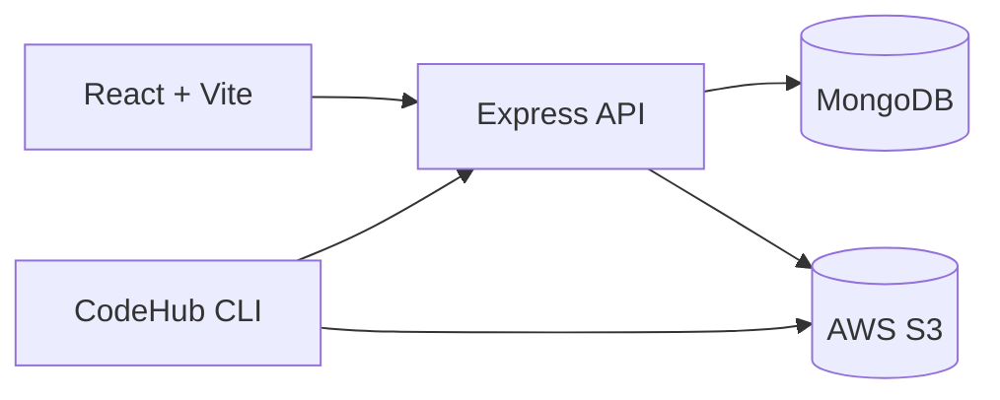
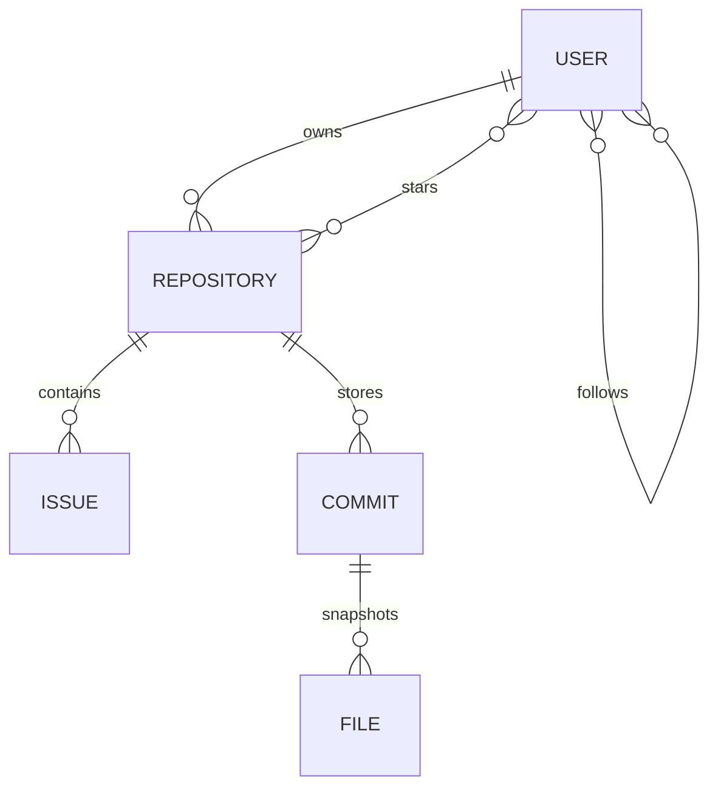

# 🚀 CodeHub

> **A GitHub-inspired full-stack platform with a custom Git-like CLI,
> repository browser, issues, commit history, AWS S3 backed snapshot
> storage, and JWT-secured collaboration.**

> **Status:** Actively Developed

------------------------------------------------------------------------

# 📸 Demo

| Frontend | Backend |
|----------|----------|
| https://code-hub-taupe.vercel.app/ | Railway |

---

## 🏠 Dashboard

The main dashboard allows users to explore repositories, discover developers, search projects, and manage their own repositories.


---

## 📂 Repository Browser

Browse repository contents, navigate folders, view commits, issues, and repository settings through a GitHub-inspired interface.


---

## 💻 CodeHub CLI

Initialize repositories, stage files, create commits, push snapshots to AWS S3, and synchronize them with the web application.


------------------------------------------------------------------------

# ✨ Features

-   JWT Authentication
-   Repository CRUD
-   User Profiles
-   Follow / Unfollow
-   Stars
-   Issues
-   Contribution Heatmap
-   Repository Browser
-   README Renderer
-   Commit History
-   Git-like CLI (`init`, `add`, `commit`, `push`, `pull`, `revert`,
    `sync`)
-   AWS S3 Snapshot Storage
-   MongoDB
-   REST APIs
-   Socket.IO
-   Smoke Tests
-   GitHub Actions CI

------------------------------------------------------------------------

# 🏗 Architecture



------------------------------------------------------------------------

# 🔄 CLI Workflow

``` text
Working Directory
        │
init
        │
add
        │
commit
        │
push
        │
AWS S3
        │
sync
        │
MongoDB
        │
Frontend
```

------------------------------------------------------------------------

# 🧩 Tech Stack

  Layer      Tech
  ---------- ---------------------------
  Frontend   React, Vite, Tailwind CSS
  Backend    Node.js, Express
  Database   MongoDB
  Storage    AWS S3
  Auth       JWT, bcrypt
  Realtime   Socket.IO
  Testing    Smoke Tests

------------------------------------------------------------------------

# 📂 Project Structure

``` text
Github-Clone
├── frontend
│   ├── components
│   ├── pages
│   ├── hooks
│   └── utils
├── backend
│   ├── controllers
│   ├── routes
│   ├── middleware
│   ├── models
│   ├── services
│   ├── utils
│   └── index.js
└── README.md
```

------------------------------------------------------------------------

# 🗄 Data Model



------------------------------------------------------------------------

# 📦 Storage Responsibilities

  Storage   Purpose
  --------- ---------------------------------------
  MongoDB   Metadata, users, repositories, issues
  AWS S3    Repository snapshots and files
  .myGit    Local staging and commits

------------------------------------------------------------------------

# 🚀 Getting Started

## Clone

``` bash
git clone <repo-url>
```

## Backend

``` bash
cd backend
npm install
npm start
```

## Frontend

``` bash
cd frontend
npm install
npm run dev
```

------------------------------------------------------------------------

# 🔐 Environment

``` env
PORT=
MONGODB_URI=
JWT_SECRET=
AWS_ACCESS_KEY_ID=
AWS_SECRET_ACCESS_KEY=
AWS_REGION=
S3_BUCKET=
```

------------------------------------------------------------------------

# ⚙ CLI

``` bash
init
add .
commit "message"
push
sync
pull
revert <commitId>
```

------------------------------------------------------------------------

# 🌐 REST APIs

### Authentication

-   POST /signup
-   POST /login
-   POST /logout

### Repository

-   POST /repo/create
-   GET /repo/all
-   GET /repo/:id
-   PUT /repo/update/:id
-   DELETE /repo/delete/:id
-   POST /repo/:id/star
-   DELETE /repo/:id/star

### Repository Browser

-   GET /repo/:id/files
-   GET /repo/:id/file
-   GET /repo/:id/readme
-   GET /repo/:id/commits
-   POST /repo/:id/sync

### Issues

-   Create
-   Update
-   Delete
-   List

------------------------------------------------------------------------

# 🧪 Testing

``` bash
npm run smoke:test
```

------------------------------------------------------------------------

# 🔒 Security

-   JWT Authentication
-   bcrypt Password Hashing
-   Protected Routes
-   Ownership Authorization
-   Secure S3 Access

------------------------------------------------------------------------

# 🛣 Roadmap

-   Pull Requests
-   Branches
-   Merge Support
-   Repository Insights
-   Notifications
-   Dark Mode
-   Collaborators
-   Code Diff Viewer

------------------------------------------------------------------------

# 🤝 Contributing

1.  Fork
2.  Create Branch
3.  Commit
4.  Push
5.  Open PR

------------------------------------------------------------------------

# 📜 License

MIT

------------------------------------------------------------------------

# ⭐ Why CodeHub?

Unlike traditional GitHub clones, CodeHub includes a custom Git-like CLI
that stages, commits, pushes, pulls, reverts, and synchronizes
repository snapshots with AWS S3 while exposing them through a modern
React application.
